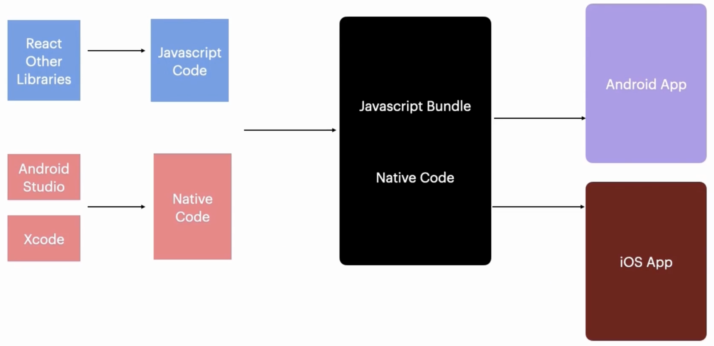
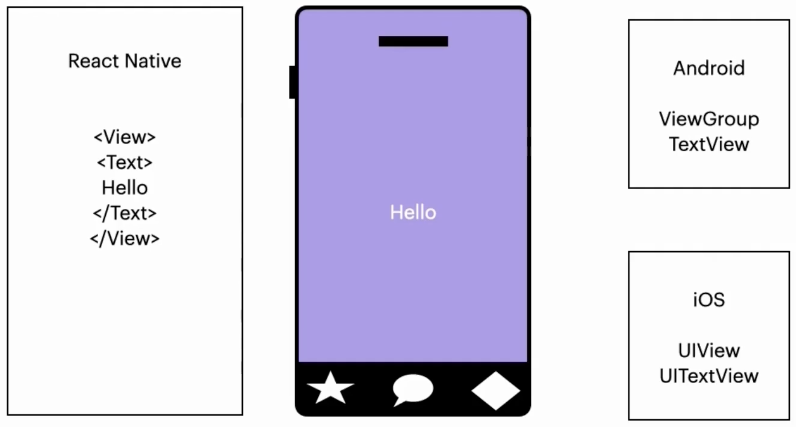
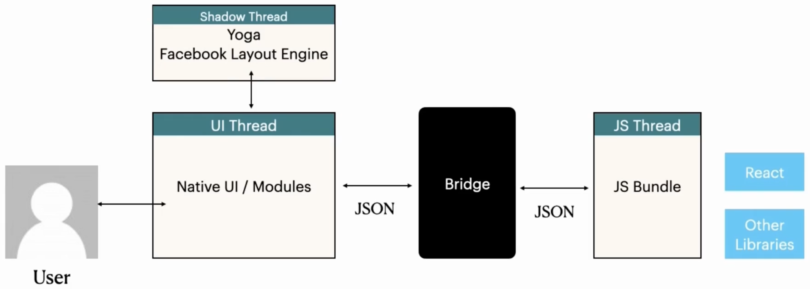

# HOW IT WORKS

JS code for common functionality across platforms, and platform-specific code (to access features unique to platform), are built with RN build tool (command line or Android Studio/Xcode) to generate APK (Android) or IPA (iOS).

RN components have native platform equivalents.

## Architecture (Legacy)

When user interacts with RN app on device, they interact with **UI thread**. UI thread talks with native UI and modules (e.g., Bluetooth, camera).

There's **shadow thread** running Facebook Yoga Layout engine, which translates or creates layouts for app.

3rd thread is **JS thread** that runs **JS bundle** (code and libs written in JS). When user interacts with UI, action transformed to JSON serialized object and passed to JS thread through **bridge**. JS thread knows how to handle action and passes info back same way to UI thread to present to user. Communication is async. Bridge is bottleneck.
