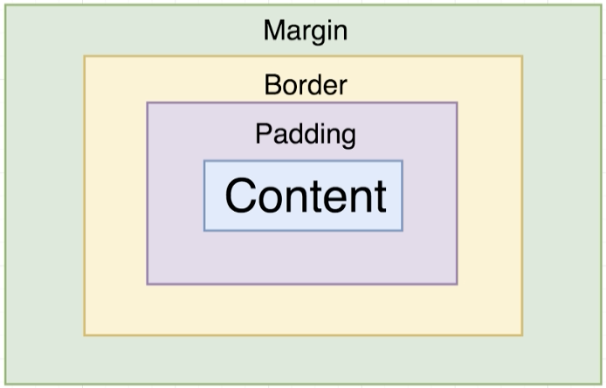

# BOX OBJECT MODEL



Content and padding show background color. Border and margin do not.

## Style Specifiers

Padding: `paddingLeft`, `paddingRight`, `paddingHorizontal`, `paddingTop`, `paddingBottom`, `paddingVertical`, `padding`

Border: `borderLeftWidth`, `borderRightWidth`, `borderTopWidth`, `borderBottomWidth`, `borderWidth`

Margin: `marginLeft`, `marginRight`, `marginHorizontal`, `marginTop`, `marginBottom`, `marginVertical`, `margin`

## Example

```javascript
<View style={styles.viewStyle}>
  // ...
</View>
// ...
const styles = StyleSheet.create({
  viewStyle: {
    borderWidth: 3,
    borderColor: 'black'
  },
  textStyle: {
    borderWidth: 1,
    borderColor: 'red',
    marginHorizontal: 20,
    marginVertical: 10
  }
});
```
