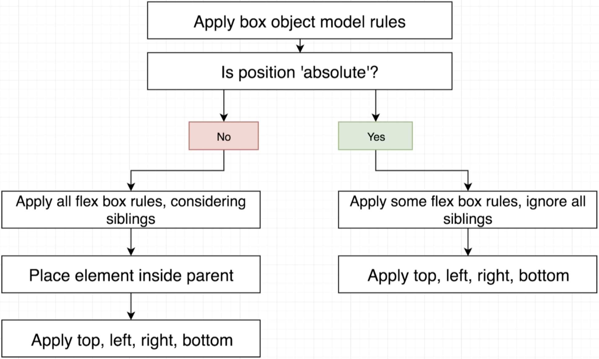

# LAYOUT SYSTEMS

3 systems depending on situation.

## 1. Box Object Model

Height/width of element, plus space surrounding it. Similar to CSS.

For positioning single element.

## 2. Flex Box

How sibling elements are laid out inside parent.

For positioning multiple elements with same parent.

## 3. Position

How single element is laid out inside parent.

To override Box Object Model and Flex Box.

## Flow

