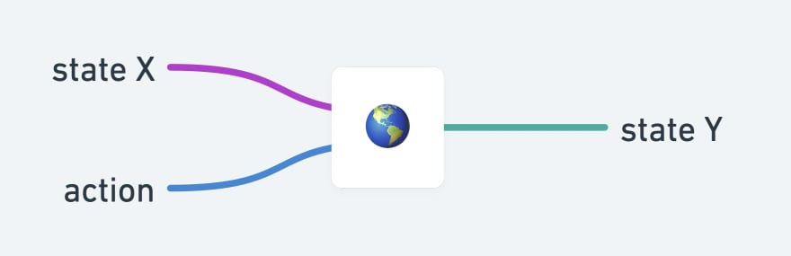

# `createStore`

Creates Redux store. Takes one mandatory arg `reducer` and two optional args - `preloadedState` (`initialState`) and `enhancer`.

Reducer is pure function that takes `state` and `action` and returns new `state`.

Existing state `X`. Some action taken, regardless of origin and reason, that might change state. Reducer's job is to figure out new state `Y`.
